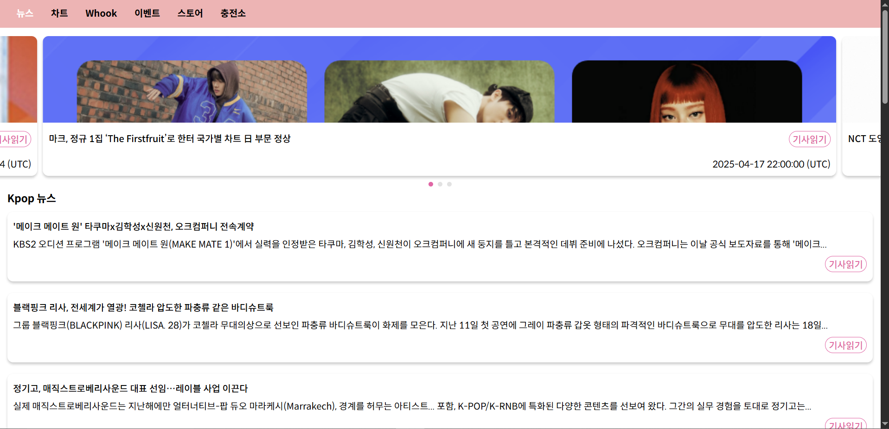

# KpopWeb
## 구현 기능
- 탭을 이용한 페이지 전환
- 탭 스와이프(데스크탑, 모바일 모두 지원)
- 슬라이드 스와이프(데스크탑, 모바일 모두 지원) 및 버튼 클릭 시 해당 외부 페이지 이동
- 무한 슬라이드
- 인디케이터를 통해 해당 슬라이더로 이동
- Kpop 관련 뉴스(네이버) 무한 스크롤 및 버튼 클릭시 해당 뉴스 페이지 이동

## 완성 이미지
### 모바일(459x900)
.png)
###  모바일(414x896)
.png)
### 태블릿(820x1180)
.png)
### 데스크탑


## 실행 방법
1. 프로젝트 클론 
```
git clone https://github.com/MinjinChae/KpopWeb.git
```
2. 의존성 패키지 설치 및 프로젝트 실행
```
cd frontend/
npm install
npm run start
```

## 개발 환경
- react: v18.2.0
- react-dom: v18.2.0
- react-router-dom: v7.5.0
- styled-components: v6.1.17
- axios: v1.8.4
- Naver 뉴스 Search API 

## 파일 구조</h1>
```
📦src
 ┣ 📂assets
 ┃ ┣ 📜babymonster.jpg
 ┃ ┣ 📜nct.jpg
 ┃ ┗ 📜worldchart.png
 ┣ 📂components
 ┃ ┣ 📜Button.js
 ┃ ┣ 📜Card.js
 ┃ ┣ 📜Footer.js
 ┃ ┣ 📜Indicator.js
 ┃ ┣ 📜Layout.js
 ┃ ┣ 📜Navbar.js
 ┃ ┣ 📜Slide.js
 ┃ ┗ 📜SlideList.js
 ┣ 📂pages
 ┃ ┗ 📜News.js
 ┣ 📂styles
 ┃ ┣ 📂fonts
 ┃ ┃ ┣ 📜font.css
 ┃ ┃ ┣ 📜SpoqaHanSansNeo-Bold.woff
 ┃ ┃ ┣ 📜SpoqaHanSansNeo-Bold.woff2
 ┃ ┃ ┣ 📜SpoqaHanSansNeo-Light.woff
 ┃ ┃ ┣ 📜SpoqaHanSansNeo-Light.woff2
 ┃ ┃ ┣ 📜SpoqaHanSansNeo-Medium.woff
 ┃ ┃ ┣ 📜SpoqaHanSansNeo-Medium.woff2
 ┃ ┃ ┣ 📜SpoqaHanSansNeo-Regular.woff
 ┃ ┃ ┣ 📜SpoqaHanSansNeo-Regular.woff2
 ┃ ┃ ┣ 📜SpoqaHanSansNeo-Thin.woff
 ┃ ┃ ┗ 📜SpoqaHanSansNeo-Thin.woff2
 ┃ ┣ 📜GlobalStyle.js
 ┃ ┗ 📜Theme.js
 ┣ 📂utils
 ┃ ┗ 📜stripHTML.js
 ┣ 📜App.css
 ┣ 📜App.js
 ┣ 📜App.test.js
 ┣ 📜index.css
 ┣ 📜index.js
 ┣ 📜reportWebVitals.js
 ┗ 📜setupTests.js
```
